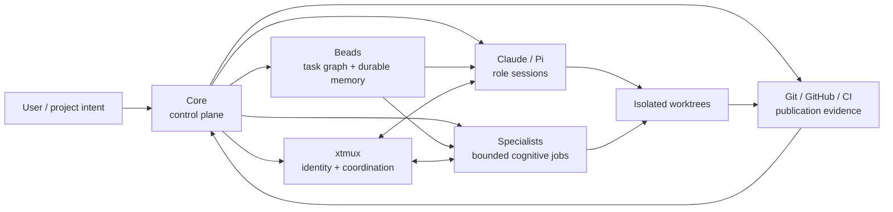
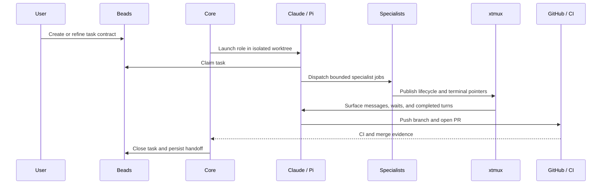

# Core

[](https://www.npmjs.com/package/xtrm-tools)
[](LICENSE)

> [!WARNING]
> **Documentation freshness**
>
> XTRM is evolving quickly. Long-form documentation can lag behind the current runtime.
> For the exact revision or installed version you are using, treat these as the operational authorities:
>
> 1. the source and generated contracts at that revision;
> 2. `xt --help` and `xt <command> --help`;
> 3. the canonical workflow skills, especially `/using-xtrm`, `/multiplexing`, and `/using-specialists`;
> 4. `CHANGELOG.md`, release notes, and merged pull requests.
>
> The README is an orientation surface, not a substitute for the live command contract. For development or integration work, clone and inspect Core, Specialists, and xtmux together rather than relying only on npm package contents.

> [!NOTE]
> **Naming**
>
> **XTRM** is the whole stack. **Core** is its control-plane component and this repository's name. Core is currently distributed on npm as `xtrm-tools`; that package name is transitional and is planned for retirement as the three repositories converge into the XTRM monorepo.

**Core (`xt`) is the local control plane of XTRM for persistent, multi-agent software development.**

It launches Claude and Pi in isolated worktrees, binds work to durable Bead contracts, distributes skills and policies, enforces lifecycle gates, coordinates Specialists and xtmux, projects live topology across repositories, and maintains the installed runtime through `init`, `update`, `doctor`, and release gates.

XTRM is not a hosted agent platform. It is a local, inspectable operating layer built around Git, tmux, Beads, Claude Code, Pi, and normal pull-request workflows.

## The XTRM stack



| Component | Primary responsibility |
|---|---|
| **Core** | Install, launch, govern, observe, update, and release the local XTRM stack |
| **Specialists** | Execute fresh, role-bounded jobs with structured handoffs and review evidence |
| **xtmux** | Provide tmux-native identity, lifecycle state, messages, waits, monitors, and event streams |
| **Beads** | Hold task contracts, claims, dependencies, status, notes, and cross-session memory |
| **Git / GitHub** | Remain the publication and integration authority |

## What Core owns today

### Runtime launch and isolation

`xt claude` and `xt pi` launch role-aware sessions in dedicated Git worktrees. A launch can carry:

- a Bead contract;
- a Specialist role;
- model and surface overrides;
- parent/coordinator lineage;
- branch and worktree identity;
- runtime metadata consumed by xtmux and Specialists.

The launcher waits for verified runtime readiness before assigning a Bead, so task ownership is tied to the actual agent instance rather than a guessed process.

### Durable workflow governance

Core integrates Beads into the session lifecycle:

- claim before editing;
- scoped edit and worktree-boundary enforcement;
- commit and stop gates;
- memory acknowledgement and durable notes;
- session-close and publication workflows;
- two-tier task tracking when the runtime exposes a native task system.

Beads is the task authority. XTRM does not replace it with a parallel hidden queue.

### Cross-runtime policy compilation

Policies in `policies/` compile into Claude hooks and Pi extensions from one managed source.

Current policy families include:

- Bead claim and lifecycle gates;
- session-flow and stop checks;
- quality and environment checks;
- worktree-boundary protection;
- project-memory injection;
- GitNexus integration;
- runtime-specific skill activation.

The installer tracks ownership and updates only assets it can prove it wrote. User-authored skills and hooks are preserved.

### Skills and role distribution

Core maintains the global and per-project skills views used by Claude and Pi. It also vendors the released Specialists workflow skills under a pinned asset contract.

Skills cover planning, testing, review, debugging, documentation, release operations, security, service knowledge, multi-agent coordination, and project-specific extensions. The README intentionally does not duplicate the full catalog. Use `xt skills --help` and the generated skills documentation for the current command surface.

### Runtime UX and operator feedback

Core also ships the runtime-facing UI layer:

- a Claude statusline for active claim, task state, model, context health, and token usage;
- XTRM-owned Pi themes, density controls, rich tool summaries, and diff previews;
- Pi overlays for live `sp ps` and `sp feed` inspection without leaving the agent UI;
- structured install/update/doctor feedback and update-availability checks.

These are operational surfaces, not cosmetic add-ons: they keep task identity, context pressure, Specialist progress, and environment drift visible during long-running work.

### Aggregated topology

`xt topology` joins six live sources into one read-only projection:

```text
xtmux + tmux + Specialists + Beads + git worktrees + GitHub pull requests
```

It answers:

- which agents and jobs are running;
- which role, Bead, worktree, and branch each one owns;
- which coordinator spawned which Specialist jobs;
- whether branches collide;
- whether implementation branches have pull requests or have landed;
- which source is unavailable or degraded.

```bash
xt topology
xt topology --view chains
xt topology --view worktrees
xt topology --view integration
xt topology --json
```

Completion is never inferred from terminal text. The projection uses Bead state, Specialist job state, and pull-request evidence.

### Installation, repair, and fleet maintenance

The operator surface is deliberately small:

```bash
xt init -y
xt update
xt update --apply
xt doctor
xt version --check-updates
```

`xt update` is dry-run by default and can inspect or repair one repository, a directory tree, or a configured fleet. `xt doctor` reports installation, managed-asset, runtime, package, and drift health.

### Release and distribution safety

Core owns coordinated release validation for the stack:

- generated registry and payload parity;
- Specialists asset-contract pinning;
- policy-to-hook wiring checks;
- skill-size and forbidden-guidance gates;
- fresh-machine installation smoke;
- global install and drift-repair smoke;
- changelog and package metadata;
- release skill and operator runbook.

## Quick start

Install the three currently published runtime packages explicitly. `xtrm-tools` is the transitional npm package name for Core:

```bash
npm install --global \
  xtrm-tools \
  @jaggerxtrm/xtmux \
  @jaggerxtrm/specialists
```

Initialize the machine and current repository:

```bash
xt install
xt init -y
sp init --global
sp init
xt doctor
```

Create and claim a durable task:

```bash
bd create "Describe the work" -t task -p 2 --json
bd update <bead-id> --claim --json
```

Launch a tracked role session:

```bash
xt claude --role executor --bead <bead-id>
# or
xt pi --role reviewer --bead <bead-id>
```

Inspect the running system:

```bash
xt topology --view chains
xt topology --view integration
xtmux dashboard sessions-only
sp ps
```

## Representative workflow



## Capability map

| Area | Main surfaces |
|---|---|
| Launch | `xt claude`, `xt pi`, `xt attach` |
| Worktrees | `xt worktree`, `xt end` |
| Task governance | Beads hooks, claims, close and memory gates |
| Skills | `xt skills`, managed global/project views |
| Policies | `scripts/compile-policies.mjs`, Claude hooks, Pi extensions |
| Topology | `xt topology` and its read-only views |
| Maintenance | `xt init`, `xt update`, `xt doctor`, update checks |
| Publication | `xt end`, normal Git/PR flow, release gates |
| Diagnostics | `xt debug`, `xt report`, xtmux journal and topology routes |
| Specialists | role launch, vendored workflow skills, asset-contract validation |

## Authority and safety model

- **Beads owns task truth.**
- **Git owns source and integration truth.**
- **GitHub and CI own publication evidence.**
- **Specialists owns managed job execution and result persistence.**
- **xtmux owns local runtime identity, coordination, and event delivery.**
- **Core owns installation, policy, orchestration entry points, and aggregate views.**
- Pane capture is for live diagnosis, not final-result retrieval.
- XTRM does not collect telemetry or send project data to an XTRM service.

## Current boundaries

The current stack supports explicit role launch, parallel Specialist jobs, durable coordination, and operator-visible topology.

The canonical deterministic chain-template resolver and exact node-dispatch program described in the design documents is **not yet implemented**. Current orchestration remains contract-driven and explicit rather than a hidden autonomous DAG engine.

## Documentation

| Document | Purpose |
|---|---|
| [XTRM-GUIDE.md](XTRM-GUIDE.md) | Full operating guide |
| [docs/worktrees.md](docs/worktrees.md) | Worktree lifecycle and session isolation |
| [docs/xt-pi-role.md](docs/xt-pi-role.md) | Role-aware Claude/Pi launch |
| [docs/xt-topology.md](docs/xt-topology.md) | Aggregated topology projection |
| [docs/policies.md](docs/policies.md) | Policy compiler and runtime wiring |
| [docs/skills.md](docs/skills.md) | Skill system and catalog |
| [docs/release.md](docs/release.md) | Release and smoke-gate contract |
| [docs/design/xtrm-orchestration-determinism-final-consolidated-report-2026-07-23.md](docs/design/xtrm-orchestration-determinism-final-consolidated-report-2026-07-23.md) | Audit closure and deterministic-orchestration design |
| [CHANGELOG.md](CHANGELOG.md) | Released changes |

## Development

```bash
npm install
npm test --workspace cli
npm run typecheck --workspace cli
npm run check:registry-pack-parity
npm run check:payload-hygiene
```

Use the repository-specific agent instructions and Beads workflow before editing.

---

MIT License
